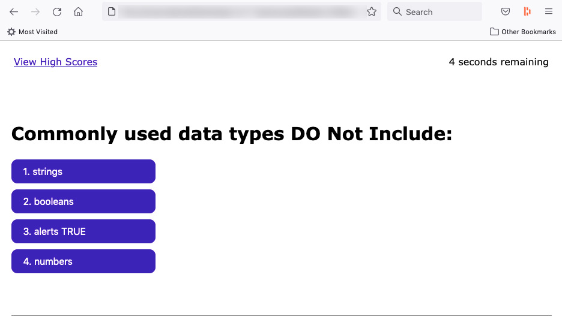

# Module 4 Challenge: Code Quiz

This browser-based JS-powered quiz has the following features/functions:
- When user clicks the "Start Quiz" button, a countdown timer begins, and the first question is presented.
- If the user selects an incorrect answer, the user loses 10 seconds of the time that is available for him.
- If the user selects the correct answer, the next question is presented  
- When the last question is answered correctly, or the countdown timer hits zero, the game ends.
- When the game ends, the user is asked to provide his name/initials and save his score.
- If the user opts to save his score, his score will be saved on the browser's localStorage. This score, along with the score of past attempts on the same machine will be fetched for display on a "High Scores" page as well.

